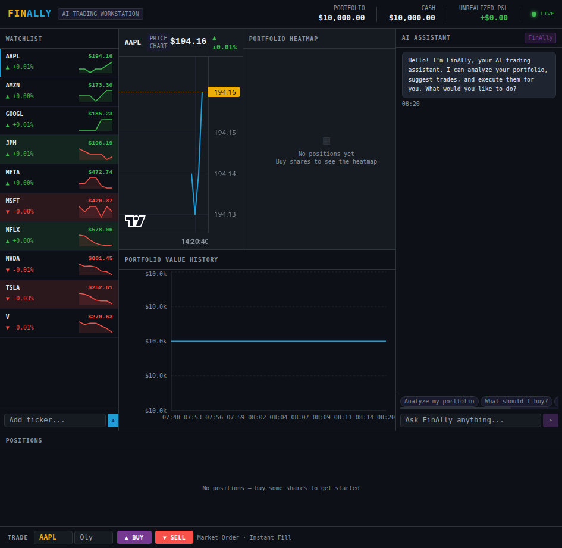

# FinAlly — AI Trading Workstation

A visually stunning AI-powered trading workstation that streams live market data, simulates portfolio trading, and integrates an LLM chat assistant that can analyze positions and execute trades via natural language.

Built entirely by coding agents as a capstone project for an agentic AI coding course.



## Features

- **Live price streaming** via SSE with green/red flash animations and sparklines
- **Simulated portfolio** — $10k virtual cash, market orders, instant fills
- **Portfolio visualizations** — treemap heatmap, P&L chart, positions table
- **AI chat assistant** — analyzes holdings, suggests and auto-executes trades via natural language
- **Watchlist management** — add/remove tickers manually or via the AI
- **Dark terminal aesthetic** — Bloomberg-inspired, data-dense layout

## Quick Start

### Docker (recommended)

```bash
# Clone and configure
cp .env.example .env
# Edit .env — add your OPENROUTER_API_KEY (required for AI chat)

# Build and run
docker build -t finally .
docker run -v finally-data:/app/db -p 8000:8000 --env-file .env finally

# Or with docker-compose
docker-compose up
```

Open **http://localhost:8000**. The simulator starts immediately — no API key needed to see live prices.

### Convenience Scripts

```bash
# macOS / Linux
./scripts/start_mac.sh          # Build (if needed) and run
./scripts/start_mac.sh --build  # Force rebuild
./scripts/stop_mac.sh           # Stop container (data persists)

# Windows PowerShell
.\scripts\start_windows.ps1
.\scripts\stop_windows.ps1
```

### Development (without Docker)

```bash
# Backend
cd backend
uv sync --dev
uv run uvicorn app.main:app --reload --port 8000

# Frontend (separate terminal)
cd frontend
npm install
npm run dev     # dev server on :3000
npm run build   # static export to frontend/out/
```

## Environment Variables

| Variable | Required | Description |
|---|---|---|
| `OPENROUTER_API_KEY` | For AI chat | OpenRouter API key — get one at openrouter.ai |
| `MASSIVE_API_KEY` | No | Massive (Polygon.io) key for real market data; omit to use the built-in simulator |
| `LLM_MOCK` | No | Set `true` for deterministic mock LLM responses (E2E testing) |

## Architecture

Single Docker container serving everything on port 8000:

```
Docker Container (port 8000)
├── FastAPI (Python/uv)
│   ├── /api/*           REST endpoints (portfolio, watchlist, chat, health)
│   ├── /api/stream/*    SSE price streaming
│   └── /*               Static files (Next.js export)
└── SQLite (volume-mounted at /app/db/finally.db)
```

- **Frontend**: Next.js 14 with TypeScript and Tailwind CSS, built as a static export
- **Backend**: FastAPI (Python), managed with `uv`
- **Database**: SQLite with lazy initialization — no setup required
- **Real-time**: Server-Sent Events (SSE), native `EventSource` on the client
- **AI**: LiteLLM → OpenRouter (Cerebras inference) with structured Pydantic outputs
- **Market data**: GBM simulator (default) or Massive/Polygon.io API

## Project Structure

```
finally/
├── frontend/           # Next.js TypeScript project (static export)
│   ├── app/            # Next.js app router
│   ├── components/     # React components (TradingWorkstation, WatchlistPanel, etc.)
│   ├── lib/            # API client (api.ts)
│   └── types/          # TypeScript types
├── backend/            # FastAPI uv project (Python)
│   └── app/
│       ├── db/         # SQLite layer (database.py, queries.py)
│       ├── llm/        # LiteLLM integration (client.py, schemas.py)
│       ├── market/     # Price simulator, Massive client, SSE stream
│       ├── routes/     # API route handlers
│       └── main.py     # App entry point, lifespan management
├── planning/           # Project documentation and agent contracts
├── test/               # Playwright E2E tests
├── db/                 # SQLite volume mount (runtime — gitignored except .gitkeep)
├── scripts/            # Start/stop helpers (Mac/Linux + Windows)
├── Dockerfile          # Multi-stage: Node 20 → Python 3.12
├── docker-compose.yml
└── .env.example
```

## API Endpoints

| Method | Path | Description |
|--------|------|-------------|
| GET | `/api/stream/prices` | SSE stream of live price updates |
| GET | `/api/portfolio` | Positions, cash balance, total value, P&L |
| POST | `/api/portfolio/trade` | Execute a trade `{ticker, quantity, side}` |
| GET | `/api/portfolio/history` | Portfolio value snapshots over time |
| GET | `/api/watchlist` | Current watchlist with latest prices |
| POST | `/api/watchlist` | Add ticker `{ticker}` |
| DELETE | `/api/watchlist/{ticker}` | Remove ticker |
| POST | `/api/chat` | Send AI chat message, receive response + auto-executed actions |
| GET | `/api/health` | Health check |

## Testing

```bash
# Backend unit tests
cd backend && uv run pytest -v

# Frontend unit tests
cd frontend && npm test

# E2E tests (requires running container with LLM_MOCK=true)
cd test && npm install && npx playwright test
```

## License

See [LICENSE](LICENSE).
